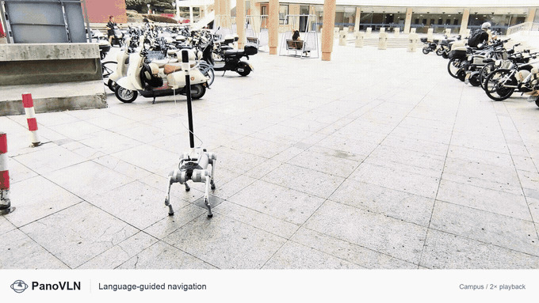

<div align="center">
  
  <h3>Towards Effective Panoramic Vision-and-Language Navigation</h3>
  <p>See in 360°. Navigate with language.</p>

  <p>
    <a href="https://wangzhen-w.github.io/PanoVLN/"></a>
    <a href="docs/reproduction.md"></a>
    <a href="docs/assets/paper/PanoVLN.pdf"></a>
    
    <a href="https://github.com/wangzhen-w/PanoVLN"></a>
    <a href="https://github.com/wangzhen-w/PanoVLN/stargazers"></a>
    <a href="https://github.com/wangzhen-w/PanoVLN/issues"></a>
  </p>
  <p>
    <a href="https://huggingface.co/wangzhen-w/PanoVLN"></a>
    <a href="https://huggingface.co/wangzhen-w/PanoVLN_base"></a>
    <a href="https://huggingface.co/wangzhen-w/PanoVLN_realworld"></a>
    <a href="https://huggingface.co/datasets/wangzhen-w/PanoVLN"></a>
  </p>

  <p>
    Zhen Wang<sup>1</sup> · Changpeng Wang<sup>1</sup> · Zhe Liu<sup>2</sup> · Zhangyang Qi<sup>2</sup><br />
    Yuxiang Lu<sup>2</sup> · Zimo Zeng<sup>1</sup> · Donglian Qi<sup>1</sup> · Xi Chen<sup>2</sup><br />
    <sup>1</sup>Zhejiang University &nbsp;&nbsp; <sup>2</sup>The University of Hong Kong
  </p>

  <a href="https://wangzhen-w.github.io/PanoVLN/#demos">
    
  </a>
  <p><a href="https://wangzhen-w.github.io/PanoVLN/#demos">Watch the navigation demos ↗</a></p>
</div>

## 📋 Table of Contents

- [Introduction](#introduction)
- [News](#news)
- [Getting Started](#getting-started)
- [Overview of Benchmark & Model Zoo](#benchmark-and-model-zoo)
- [Customization](#customization)
- [Contribute](#contribute)
- [Community Deployment & Best Practices](#community)
- [Citation](#citation)
- [License](#license)
- [Acknowledgements](#acknowledgements)

<a id="introduction"></a>
## 🏠 Introduction

PanoVLN follows natural-language navigation instructions using 360° RGB panoramas. This repository provides the code and checkpoints to train a policy, evaluate it in Habitat, and deploy it on a Unitree Go2 with a panoramic camera.

| I want to… | Start here |
| --- | --- |
| Run a released model in simulation | [Install and evaluate](docs/reproduction.md#evaluate-a-checkpoint) |
| Download checkpoints or training annotations | [Model zoo and datasets](#model-zoo) |
| Train or fine-tune a model | [Prepare data and train](docs/reproduction.md#prepare-training-data) |
| Collect new trajectories and instructions | [Dataset generation](dataset_create/README.md) |
| Deploy on a robot | [Real-world deployment](realworld/README.md) |
| Explore the method, results, and videos | [Project page](https://wangzhen-w.github.io/PanoVLN/) |

<a id="news"></a>
## 🔥 News

- **2026-09-25:** Source code released, including training, data generation, simulation evaluation, and robot deployment.
- **Available:** Three [model checkpoints](#model-zoo) and the [training annotations](https://huggingface.co/datasets/wangzhen-w/PanoVLN) are hosted on Hugging Face.
- **Coming soon:** arXiv preprint. The arXiv badge will become a link when the preprint is available.

<a id="getting-started"></a>
## 📚 Getting Started

Use **Linux with an NVIDIA GPU** for training and model inference. Simulation also requires Habitat-Sim / Habitat-Lab 0.3.3 and the appropriate scene assets. The [reproduction guide](docs/reproduction.md) contains the environment setup and exact data layout.

```bash
git clone https://github.com/wangzhen-w/PanoVLN.git
cd PanoVLN

# After installing the environment in docs/reproduction.md:
hf download wangzhen-w/PanoVLN --local-dir checkpoints/PanoVLN
```

Next, obtain the [evaluation scenes and annotations](docs/reproduction.md#scenes-and-navigation-annotations). Edit `MODEL_PATH`, `GPU_IDS`, `PROCS_PER_GPU`, and `SAVE_PATH` at the top of the evaluation launcher to match your machine, then run:

```bash
bash scripts/eval_r2r.sh  # R2R-CE val-unseen
# or
bash scripts/eval_rxr.sh  # RxR-CE val-unseen
```

Results are written to `result.jsonl` and `result_summary.json` in your chosen output directory. The [first-run configuration](docs/reproduction.md#evaluate-a-checkpoint) starts with one worker and a small episode budget.

<details>
<summary><strong>Repository map</strong></summary>

| Path | Purpose |
| --- | --- |
| `config/` | Habitat datasets, sensors, and evaluation settings |
| `scripts/` | Data preparation, DAgger, and evaluation launchers |
| `src/train/` | Training entry point and model configuration |
| `src/qwen_vl/`, `src/panovggt/` | Navigation model and geometry encoder |
| `dataset_create/` | Trajectory sampling and instruction generation |
| `realworld/` | GPU servers, robot clients, and deployment guides |
| `docs/` | Project website and reproduction documentation |

</details>

<a id="benchmark-and-model-zoo"></a>
<a id="model-zoo"></a>
## 📦 Overview of Benchmark & Model Zoo

### Checkpoints

| Checkpoint | Use it for | Download | Local directory |
| --- | --- | --- | --- |
| **PanoVLN** | Full-data simulation results | [Hugging Face](https://huggingface.co/wangzhen-w/PanoVLN) | `checkpoints/PanoVLN/` |
| **PanoVLN Base (†)** | R2R/RxR-only navigation-data results | [Hugging Face](https://huggingface.co/wangzhen-w/PanoVLN_base) | `checkpoints/PanoVLN_base/` |
| **PanoVLN Real World** | Robot deployment with trajectory recovery and collision avoidance | [Hugging Face](https://huggingface.co/wangzhen-w/PanoVLN_realworld) | `checkpoints/PanoVLN_realworld/` |

Download the complete checkpoint directory, including its tokenizer and processor files. For training from initialization, also obtain [Qwen3.5-4B](https://huggingface.co/Qwen/Qwen3.5-4B) and the [PanoVGGT weights](https://huggingface.co/YijingGuo/PanoVGGT).

### Training data

The [PanoVLN dataset repository](https://huggingface.co/datasets/wangzhen-w/PanoVLN) contains navigation annotations and prepared training JSONL files. Scene assets are obtained separately; render the panoramic images using the [data preparation workflow](docs/reproduction.md#prepare-training-data).

```bash
hf download wangzhen-w/PanoVLN --repo-type dataset --local-dir data
```

The model and dataset share the name `PanoVLN`; the dataset URL contains **`/datasets/`**, and its download command uses **`--repo-type dataset`**.

### Benchmark reference

Val-unseen results from the manuscript. SR and SPL are percentages. † uses R2R-CE and RxR-CE navigation data; the full model additionally uses the constructed PanoVLN dataset.

| Checkpoint | R2R-CE SR ↑ | R2R-CE SPL ↑ | RxR-CE SR ↑ | RxR-CE SPL ↑ |
| --- | ---: | ---: | ---: | ---: |
| PanoVLN Base (†) | 73.9 | 67.9 | 74.1 | 63.9 |
| **PanoVLN** | **77.3** | **70.6** | **78.0** | **65.9** |

See the [project page](https://wangzhen-w.github.io/PanoVLN/#results) for the full comparisons and the [evaluation guide](docs/reproduction.md#evaluate-a-checkpoint) to reproduce these runs.

<a id="customization"></a>
## 🔧 Customization

| Change | Edit |
| --- | --- |
| Training checkpoint, data, precision, learning rates | [`src/train/config/config.yaml`](src/train/config/config.yaml) |
| Training GPUs and output directory | [`src/train/train.sh`](src/train/train.sh) |
| Evaluation checkpoint, worker count, and execution policy | [`scripts/eval_r2r.sh`](scripts/eval_r2r.sh), [`scripts/eval_rxr.sh`](scripts/eval_rxr.sh) |
| Scene paths, dataset split, and sensors | [`config/`](config/) |
| Source datasets for preprocessing and frame rendering | `DATASET_NAMES` in [`scripts/`](scripts/) |
| Robot camera, instruction, motion, and server address | [`realworld/panovln/go2_client.yaml`](realworld/panovln/go2_client.yaml) |

The model predicts **18 actions** from `forward` (0.25 m), `left` (15°), `right` (15°), and `stop`. `actions_per_replan` controls how many predicted actions are executed before the next observation. See the [training configuration guide](src/train/README.md) for supported architecture and tuning options.

<a id="contribute"></a>
## 👥 Contribute

Contributions to installation, reproducibility, dataset tooling, and robot integrations are welcome. Read [CONTRIBUTING.md](CONTRIBUTING.md), open an [issue](https://github.com/wangzhen-w/PanoVLN/issues) for substantial changes, and include the command and evidence used to validate a pull request.

<a id="community"></a>
## 🚀 Community Deployment & Best Practices

Use [GitHub Issues](https://github.com/wangzhen-w/PanoVLN/issues) to ask questions, report failures, or share a deployment. Include the commit, checkpoint, configuration, hardware, and a concise log excerpt so others can reproduce it.

- **Start with a small simulation run.** Use one worker per GPU and a few episodes, then scale once the run completes.
- **Keep experiments separate.** Evaluation resumes by skipping completed episodes; choose a new output directory when changing a checkpoint or policy.
- **Use the deployment checkpoint on the robot.** Follow the [server/client setup](realworld/README.md), inspect the client with `--print-config`, and verify server readiness before a trial.
- **Preserve the complete checkpoint and configuration.** Keep tokenizer/processor files, data paths, and evaluation settings with your experiment record.

<a id="citation"></a>
## 🔗 Citation

If you use PanoVLN, please cite the project. This entry will be updated with the arXiv identifier when it is available.

```bibtex
@misc{wang2026panovln,
  title  = {PanoVLN: Towards Effective Panoramic Vision-and-Language Navigation},
  author = {Zhen Wang and Changpeng Wang and Zhe Liu and Zhangyang Qi and
            Yuxiang Lu and Zimo Zeng and Donglian Qi and Xi Chen},
  year   = {2026},
  url    = {https://github.com/wangzhen-w/PanoVLN}
}
```

Machine-readable citation metadata is available in [CITATION.cff](CITATION.cff).

<a id="license"></a>
## 📄 License

The repository-wide code license is pending an author decision. Bundled third-party components retain their [PanoVGGT](src/panovggt/LICENSE), [NaVid](realworld/navid/licenses/LICENSE), and [NaVILA](realworld/navila/licenses/LICENSE) license notices.

The released Hugging Face model and dataset cards specify **Matterport Academic Use** terms. Consult each resource's card and the [Matterport academic-use agreement](https://matterport.com/legal/matterport-end-user-license-agreement-academic-use-model-data) before use. Obtain source scenes under their respective access and license terms.

<a id="acknowledgements"></a>
## 🙏 Acknowledgements

PanoVLN builds on [Qwen](https://github.com/QwenLM/Qwen3.5), [PanoVGGT](https://github.com/YijingGuo-June/PanoVGGT), [Habitat](https://github.com/facebookresearch/habitat-lab), and [VLN-CE](https://github.com/jacobkrantz/VLN-CE). We thank their authors and the dataset contributors for making these resources available.
