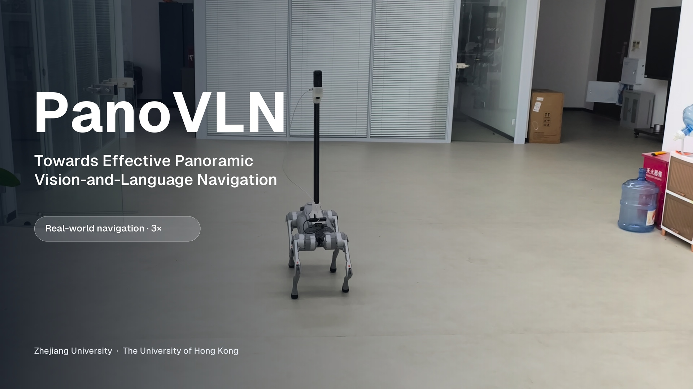

<a id="readme-top"></a>
<div align="center">
  <h1>PanoVLN</h1>
  <h3>Towards Effective Panoramic Vision-and-Language Navigation</h3>

  <p>
    Zhen Wang<sup>1</sup> · Changpeng Wang<sup>1</sup> · Zhe Liu<sup>2</sup> · Zhangyang Qi<sup>2</sup><br />
    Yuxiang Lu<sup>2</sup> · Zimo Zeng<sup>1</sup> · Donglian Qi<sup>1</sup> · Xi Chen<sup>2</sup><br />
    <sup>1</sup>Zhejiang University &nbsp;&nbsp; <sup>2</sup>The University of Hong Kong
  </p>

  <p>
    <a href="https://wangzhen-w.github.io/PanoVLN/"></a>
    <a href="docs/assets/paper/PanoVLN.pdf"></a>
    
    <a href="https://github.com/wangzhen-w/PanoVLN/stargazers"></a>
    <a href="https://github.com/wangzhen-w/PanoVLN/issues"></a>
  </p>
  <p>
    <a href="https://huggingface.co/wangzhen-w/PanoVLN"></a>
    <a href="https://huggingface.co/wangzhen-w/PanoVLN_base"></a>
    <a href="https://huggingface.co/wangzhen-w/PanoVLN_realworld"></a>
    <a href="https://huggingface.co/datasets/wangzhen-w/PanoVLN"></a>
  </p>

  <a href="https://www.youtube.com/watch?v=_QsBD9Mlrw4"></a>
  <p><a href="https://www.youtube.com/watch?v=_QsBD9Mlrw4">▶ Watch the real-world navigation video</a></p>
</div>

## Contents

[Getting Started](#getting-started) · [Data](#data-preparation) · [Models](#model-zoo) · [Training](#training) · [Evaluation](#evaluation) · [Robot Deployment](#real-world-deployment) · [Configuration](#customization) · [Citation](#citation)

<a id="introduction"></a>
## 🏠 Introduction

**PanoVLN** is a vision-and-language navigation policy that follows instructions from 360° RGB observations. It combines a Qwen3.5-4B backbone with PanoVGGT geometry features and predicts 18-action sequences. Confidence-guided execution selects how far to move before observing and planning again.

This repository provides **training and data-generation code, Habitat evaluation, three released checkpoints, and a GPU-server/Go2-client deployment pipeline**. For physical navigation, **PanoVLN Real World adds trajectory recovery and collision avoidance**, helping the robot handle route deviations and obstacles during execution.

| Task | Entry point |
| --- | --- |
| Evaluate a released checkpoint | [Environment](#getting-started) → [data layout](#data-preparation) → [evaluation](#evaluation) |
| Train or fine-tune | [Training data](#data-preparation) → [training](#training) |
| Deploy on a Unitree Go2 | [Real-world deployment](#real-world-deployment) |
| Generate new trajectories and instructions | [Dataset-generation guide](dataset_create/README.md) |
| Read the method and full results | [Paper](docs/assets/paper/PanoVLN.pdf) · [project page](https://wangzhen-w.github.io/PanoVLN/) |

<a id="news"></a>
## 🔥 News

- **2026-09-25:** Source code released, including training, data generation, simulation evaluation, and robot deployment.
- **Available:** [Three checkpoints](#model-zoo), [training annotations](https://huggingface.co/datasets/wangzhen-w/PanoVLN), and the [project page](https://wangzhen-w.github.io/PanoVLN/) with a real-world navigation video and main results.
- **Coming soon:** arXiv preprint. The badge will link to the paper when an identifier is available.

<a id="getting-started"></a>
## 📚 Getting Started

Training and model inference use **Linux with an NVIDIA GPU**. The model environment uses Python 3.12, PyTorch 2.10.0, and Transformers 5.5.0. Simulation additionally uses Habitat-Sim / Habitat-Lab **0.3.3**; the Go2 client uses its separate ROS2 environment.

```bash
git clone https://github.com/wangzhen-w/PanoVLN.git
cd PanoVLN
conda create -n panovln python=3.12 -y
conda activate panovln

python -m pip install torch==2.10.0 torchvision==0.25.0
python -m pip install \
  transformers==5.5.0 accelerate==1.13.0 peft==0.18.1 \
  deepspeed==0.18.0 numpy pillow pyyaml tqdm scipy einops timm \
  omegaconf huggingface-hub safetensors wandb
```

Choose [PyTorch CUDA wheels](https://pytorch.org/get-started/locally/) for your driver. Install [FlashAttention 2](https://github.com/Dao-AILab/flash-attention#installation-and-features) for the supplied launchers, or select `sdpa` in their attention settings. Follow the [Habitat installation steps](docs/reproduction.md#habitat-setup) before rendering or evaluation. PanoVLN runs directly from the repository; its launchers set `PYTHONPATH`.

Download the simulation model:

```bash
hf download wangzhen-w/PanoVLN --local-dir checkpoints/PanoVLN
```

Keep the checkpoint directory, including tokenizer, processor, and configuration files. See the [reproduction guide](docs/reproduction.md) for installation checks, exact configuration, outputs, and troubleshooting.

<a id="data-preparation"></a>
## 🗂️ Data Preparation

**Evaluation:** obtain [Matterport3D scenes](https://niessner.github.io/Matterport/) and [R2R-CE / RxR-CE episode annotations](https://github.com/jacobkrantz/VLN-CE#data). Evaluation renders panoramas online; training images are unnecessary for an evaluation-only setup.

**Training:** download the released annotations and prepared JSONL mixtures below, obtain the corresponding scenes, and render their panoramic observations. The PanoVLN trajectories use [HM3D](https://aihabitat.org/datasets/hm3d/) scenes.

```bash
hf download wangzhen-w/PanoVLN --repo-type dataset --local-dir data
```

The [dataset repository](https://huggingface.co/datasets/wangzhen-w/PanoVLN) contains annotations and training JSONL files; scene assets and rendered images are prepared separately. The model and dataset have the same name, so retain `--repo-type dataset` in this command.

```text
data/
├── general_vln_dataset/
│   ├── r2r/{split}/{split}.json.gz
│   ├── rxr/{split}/{split}_guide.json.gz
│   └── panovln/train.json.gz
├── scene/
│   ├── mp3d/{scene_id}/
│   └── hm3d/{train,val}/{scene_id}/
├── sub_dataset/                 # r2r, rxr, panovln, dagger JSONL
├── images/{dataset}/{episode_or_trajectory_id}/frame_0.jpg
├── train_r2r_rxr.jsonl
├── r2r_rxr_dagger.jsonl
├── r2r_rxr_dagger_panovln.jsonl
└── train.jsonl                  # Selected or rebuilt training mixture
```

For base training, set `DATASET_NAMES=(r2r rxr)`, `GPU_IDS`, and `PROCESSES_PER_GPU` in [`scripts/extract_frame.sh`](scripts/extract_frame.sh), then:

```bash
bash scripts/extract_frame.sh
cp data/train_r2r_rxr.jsonl data/train.jsonl
```

For full-data training, render all datasets included in `r2r_rxr_dagger_panovln.jsonl` and select that file. The [data-preparation guide](docs/reproduction.md#prepare-training-data) covers annotation regeneration, custom mixtures, and DAgger. Image roots must point to `data/`, since JSONL paths already begin with `images/`.

<a id="benchmark-and-model-zoo"></a>
<a id="model-zoo"></a>
## 📦 Models & Benchmarks

### Released checkpoints

| Checkpoint | Intended use | Download | Local directory |
| --- | --- | --- | --- |
| **PanoVLN Base (†)** | R2R/RxR-only navigation-data experiments | [Hugging Face](https://huggingface.co/wangzhen-w/PanoVLN_base) | `checkpoints/PanoVLN_base/` |
| **PanoVLN** | Full-data simulation evaluation | [Hugging Face](https://huggingface.co/wangzhen-w/PanoVLN) | `checkpoints/PanoVLN/` |
| **PanoVLN Real World** | Physical deployment, with enhanced trajectory recovery and collision avoidance | [Hugging Face](https://huggingface.co/wangzhen-w/PanoVLN_realworld) | `checkpoints/PanoVLN_realworld/` |

```bash
# Choose the checkpoint for your experiment.
hf download wangzhen-w/PanoVLN_base --local-dir checkpoints/PanoVLN_base
hf download wangzhen-w/PanoVLN_realworld --local-dir checkpoints/PanoVLN_realworld
```

The [real-world deployment section](#real-world-deployment) explains when and how to use the deployment checkpoint. To initialize a new policy, download [Qwen3.5-4B](https://huggingface.co/Qwen/Qwen3.5-4B) and [PanoVGGT](https://huggingface.co/YijingGuo/PanoVGGT) as described under [Training](#training).

### Benchmark reference

Manuscript results on **Val-Unseen**. SR and SPL are percentages. † uses R2R-CE and RxR-CE navigation data; the full model additionally uses the constructed PanoVLN dataset.

| Checkpoint | R2R-CE SR ↑ | R2R-CE SPL ↑ | RxR-CE SR ↑ | RxR-CE SPL ↑ |
| --- | ---: | ---: | ---: | ---: |
| PanoVLN Base (†) | 73.9 | 67.9 | 74.1 | 63.9 |
| **PanoVLN** | **77.3** | **70.6** | **78.0** | **65.9** |

Full baseline comparisons and real-world results are on the [project page](https://wangzhen-w.github.io/PanoVLN/#results).

<a id="training"></a>
## 🚀 Training

### Initialize and train

```bash
hf download Qwen/Qwen3.5-4B --local-dir checkpoints/Qwen3.5-4B
hf download YijingGuo/PanoVGGT --local-dir checkpoints/PanoVGGT
```

Configure the following before launching:

| File | Settings |
| --- | --- |
| [`src/train/config/config.yaml`](src/train/config/config.yaml) | `model.name_or_path`, `model.panovggt_checkpoint_path`, `data.train_jsonl`, `data.train_image_root`, batch size, attention, and learning rates |
| [`src/train/train.sh`](src/train/train.sh) | `GPU_DEVICES`, `CONFIG_PATH`, and a fresh `OUTPUT_DIR` |

Defaults use `checkpoints/Qwen3.5-4B/`, `checkpoints/PanoVGGT/model.pt`, `data/train.jsonl`, and `data/`. The launcher defaults to eight GPUs; set the GPU list and batch size for your machine. The PanoVGGT encoder remains frozen while the selected language, visual, and fusion modules are trained.

```bash
bash src/train/train.sh
```

`OUTPUT_DIR` receives `train.log`, periodic `checkpoint-*` directories, and the final model/tokenizer/processor. Validation is disabled by default. The launcher takes its settings from the files above and rejects command-line overrides; see the [training guide](docs/reproduction.md#train-a-model) for batch-size accounting, validation, and resuming.

### DAgger and fine-tuning

Set the trained `MODEL_PATH`, source datasets, GPUs, and output paths in [`scripts/generate_dagger_data.sh`](scripts/generate_dagger_data.sh), then collect corrective trajectories:

```bash
bash scripts/generate_dagger_data.sh
```

Include `dagger` in `DATASET_NAMES` in [`scripts/prepare_dataset.sh`](scripts/prepare_dataset.sh), point `model.name_or_path` to the starting navigation checkpoint, and use a new training output directory:

```bash
bash scripts/prepare_dataset.sh --overwrite
bash src/train/train.sh
```

The [reproduction guide](docs/reproduction.md#refine-with-dagger) explains the generated annotations, images, and mixture selection.

<a id="evaluation"></a>
## 📈 Evaluation

Edit [`scripts/eval_r2r.sh`](scripts/eval_r2r.sh) or [`scripts/eval_rxr.sh`](scripts/eval_rxr.sh). For a first R2R run, set these variables **inside the launcher**:

```bash
MODEL_PATH="./checkpoints/PanoVLN"
GPU_IDS="0"
PROCS_PER_GPU=1
TOTAL_MAX_EPISODES=5
SAVE_PATH="./outputs/eval/r2r_smoke"
```

Then launch the selected benchmark:

```bash
bash scripts/eval_r2r.sh
# For RxR, configure the other launcher and use a separate SAVE_PATH:
# bash scripts/eval_rxr.sh
```

Set `TOTAL_MAX_EPISODES=0` for the complete split. Both launchers default to `val_unseen`, uncertainty-based execution, and a 4–8-action range. Preserve their benchmark-specific stop settings when reproducing reported results. Each worker loads a model; adjust `PROCS_PER_GPU` to available memory.

| Output | Contents |
| --- | --- |
| `result.jsonl` | Per-episode metrics and predicted/executed action histories |
| `result_summary.json` | Episode count, success, SPL, oracle success, distance to goal, path length, and nDTW |
| `top_down/` | Per-episode videos when `SAVE_TOPDOWN=true` |

Existing episodes are skipped on resume. Use a new `SAVE_PATH` for each checkpoint or policy configuration. See [evaluation settings](docs/reproduction.md#evaluate-a-checkpoint) for single-worker commands and output interpretation.

<a id="real-world-deployment"></a>
## 🤖 Real-world Deployment

**Use `PanoVLN_realworld` for physical navigation.** This checkpoint adds trajectory recovery and collision avoidance to instruction following, supporting recovery from route deviations and responses to obstacles. The deployment separates **model inference on a GPU server** from **camera capture and motion execution on a Unitree Go2 client**.

```text
Panoramic camera → Go2 client → HTTP /predict → GPU server
                       ↑                         │
                       └── actions + confidence ─┘
```

### 1. GPU server

In the model environment, download the deployment checkpoint and install the HTTP dependencies:

```bash
hf download wangzhen-w/PanoVLN_realworld --local-dir checkpoints/PanoVLN_realworld
python -m pip install -r realworld/panovln/requirements.txt
bash realworld/panovln/run_server.sh
```

Review `GPU_IDS`, `MODEL_PATH`, `HOST`, `PORT`, and `ATTN_IMPLEMENTATION` in [`run_server.sh`](realworld/panovln/run_server.sh). The default is GPU `0`, port `8000`, and the checkpoint above. The checkpoint supplies its PanoVGGT weights; leave `PANOVGGT_CHECKPOINT` empty.

### 2. Go2 client setup and configuration

On the robot-side machine, install FFmpeg and the client dependencies in the ROS2 Foxy Python environment, then build the included message packages:

```bash
/usr/bin/python3 -m pip install -r realworld/panovln/requirements-client.txt
source /opt/ros/foxy/setup.bash
cd realworld/panovln/ros2_unitree_api_ws
colcon build --base-paths src --packages-select unitree_api unitree_go
cd ../../..
```

Edit [`go2_client.yaml`](realworld/panovln/go2_client.yaml): set `server.server_base_url` to the GPU server's reachable address, `navigation.instruction`, the camera device/resolution, and `experiment.scene_name`, `route_id`, and `trial_id`. Match the `motion` and `odometry` settings to the robot. The client uploads up to 10 historical panoramas plus the current frame, using 1280×640 uploads by default.

Inspect the resolved configuration without opening hardware:

```bash
bash realworld/panovln/run_go2_client.sh --print-config
```

### 3. Connect, inspect, and run

The [deployment walkthrough](docs/reproduction.md#deploy-on-a-physical-robot) checks `/ready` and runs a camera/server trial with `--control-backend dry-run` before motion. The supplied YAML already selects `ros2` and sets `real_robot_ack: "yes"`; the bare launcher below **executes physical motion**:

```bash
# Start only after server readiness, camera, and robot configuration are checked.
bash realworld/panovln/run_go2_client.sh
```

The client sends a stop command on `Ctrl+C`. Each trial saves `navigation.mp4`, `navigation.json`, and `summary.json` under `outputs/realworld/<method>_<scene>_<route>_<trial>/`. Existing trial directories are preserved; increment `trial_id` for repetitions. Server logs and per-request inference timings are saved separately. See the [configuration and outputs](docs/reproduction.md#deploy-on-a-physical-robot) and [shared deployment guide](realworld/README.md) and [PanoVLN configuration/API reference](realworld/panovln/README.md).

<a id="customization"></a>
## 🔧 Configuration

| Change | Edit |
| --- | --- |
| Checkpoint, data mixture, trainable modules, precision, learning rates | [`src/train/config/config.yaml`](src/train/config/config.yaml) |
| Training GPUs and output directory | [`src/train/train.sh`](src/train/train.sh) |
| Evaluation workers, memory window, and execution policy | [`scripts/eval_r2r.sh`](scripts/eval_r2r.sh), [`scripts/eval_rxr.sh`](scripts/eval_rxr.sh) |
| Dataset split, scene paths, panoramic sensor | [`config/`](config/) |
| Preprocessing, rendering, and custom data mixtures | `DATASET_NAMES` in [`scripts/`](scripts/) |
| Robot server address, camera, instruction, motion, recording | [`realworld/panovln/go2_client.yaml`](realworld/panovln/go2_client.yaml) |

Action targets contain **18 words** from `forward` (0.25 m), `left` (15°), `right` (15°), and `stop`; terminal targets are padded with `stop`. `actions_per_replan` controls the executed prefix independently. The [training configuration guide](src/train/README.md) documents the architecture constraints, ERP cropping, and fusion options.

<a id="citation"></a>
## 🔗 Citation

If you use PanoVLN, please cite the project. This entry will be updated with the arXiv identifier when it is available.

```bibtex
@misc{wang2026panovln,
  title  = {PanoVLN: Towards Effective Panoramic Vision-and-Language Navigation},
  author = {Zhen Wang and Changpeng Wang and Zhe Liu and Zhangyang Qi and
            Yuxiang Lu and Zimo Zeng and Donglian Qi and Xi Chen},
  year   = {2026},
  url    = {https://github.com/wangzhen-w/PanoVLN}
}
```

Machine-readable citation metadata is available in [CITATION.cff](CITATION.cff).

<a id="license"></a>
## 📄 License

The repository-wide code license is pending an author decision. Bundled third-party components retain their [PanoVGGT](src/panovggt/LICENSE), [NaVid](realworld/navid/licenses/LICENSE), and [NaVILA](realworld/navila/licenses/LICENSE) license notices.

The released Hugging Face model and dataset cards specify **Matterport Academic Use** terms. Consult each resource's card and the [Matterport academic-use agreement](https://matterport.com/legal/matterport-end-user-license-agreement-academic-use-model-data) before use. Obtain source scenes under their respective access and license terms.

<a id="acknowledgements"></a>
## 🙏 Acknowledgements

PanoVLN builds on [Qwen](https://github.com/QwenLM/Qwen3.5), [PanoVGGT](https://github.com/YijingGuo-June/PanoVGGT), [Habitat](https://github.com/facebookresearch/habitat-lab), and [VLN-CE](https://github.com/jacobkrantz/VLN-CE). We thank their authors and the dataset contributors for making these resources available.
